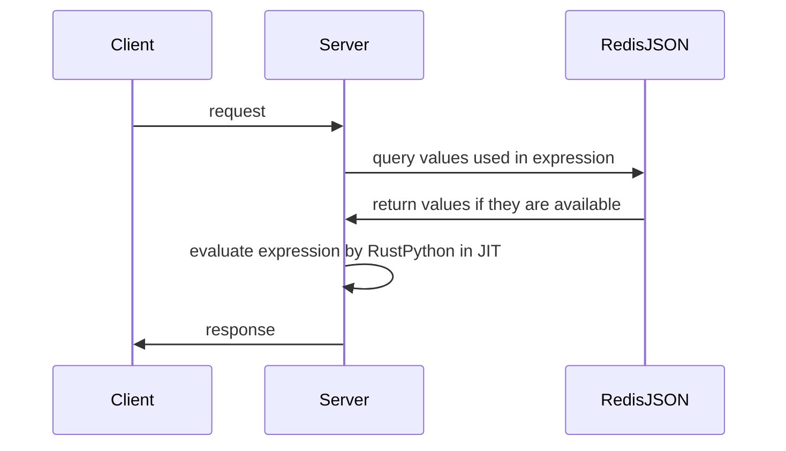

# axum-py-poc

A POC(Proof of Concept) of dynamic configurable high-performance server with [RustPython](https://github.com/RustPython/RustPython)

```mermaid
sequenceDiagram
Client->>Server: request
Server->>RedisJSON: query values used in expression
RedisJSON->>Server: return values if they are available
Server->>Server: evaluate expression by RustPython in JIT
Server->>Client: response
```
